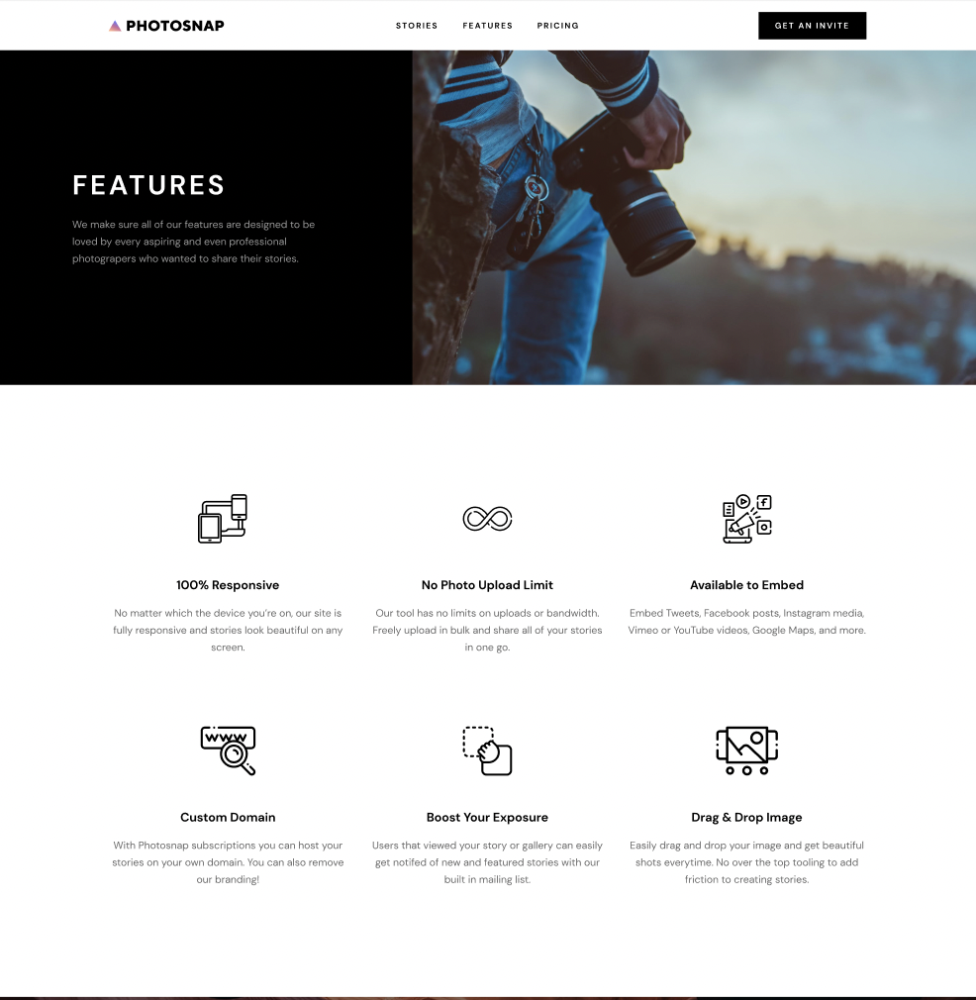
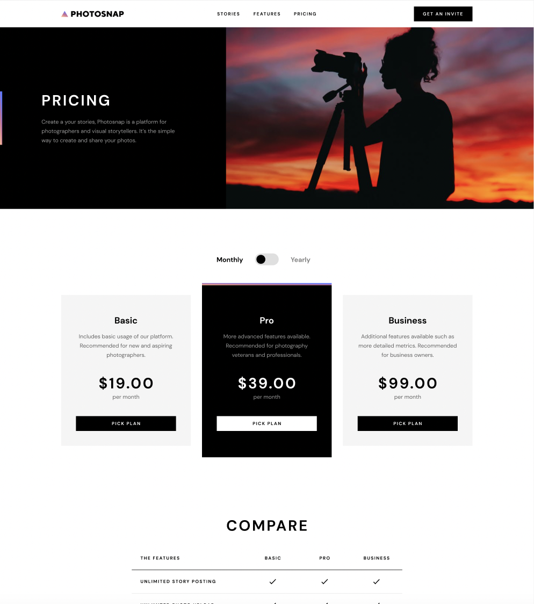

## Photosnap Website

- Marketing site for a photo-sharing app
- This is my solution to the [Photosnap Website challenge on Frontend Mentor](https://www.frontendmentor.io/challenges/photosnap-multipage-website-nMDSrNmNW).

## Live Demo
  https://trucphotosnap.netlify.app

## Table of contents

- [Overview](#overview)
  - [The challenge](#the-challenge)
  - [Screenshot](#screenshot)
- [My process](#my-process)
  - [Built with](#built-with)
- [Author](#author)

## Overview

### The challenge

Users should be able to:

- View the optimal layout for each page depending on their device's screen size
- See hover states for all interactive elements throughout the site

### Screenshot

  #### 1. Main page
      { width=50% }
       Provides an overview of the website's content and purpose, and serves as a starting point for navigating the site.
       
       
       
       
       
       
  #### 2. Stories page
      
       Medium for an artist to showcase their work and to share their vision with others. Documenting a specific event or a news story.
       
       
       
       
       
       
   #### 3. Feature Page
      { :width=50% }
      Highlight the product, service, or feature of the website

   #### 4.Pricing Page
      
      Provide detailed information about the prices and packages of service offered by business. Users have the option to pay monthly or yearly

## My process

### Built with

- Semantic HTML5 markup
- CSS custom properties
- Flexbox
- CSS Grid
- Bootstrap
- Javasript

## Author

- Linkedin - [Truc Nguyen](https://www.linkedin.com/in/truc-nguyen-480222230/)
- Github - [https://github.com/trucn0311]
